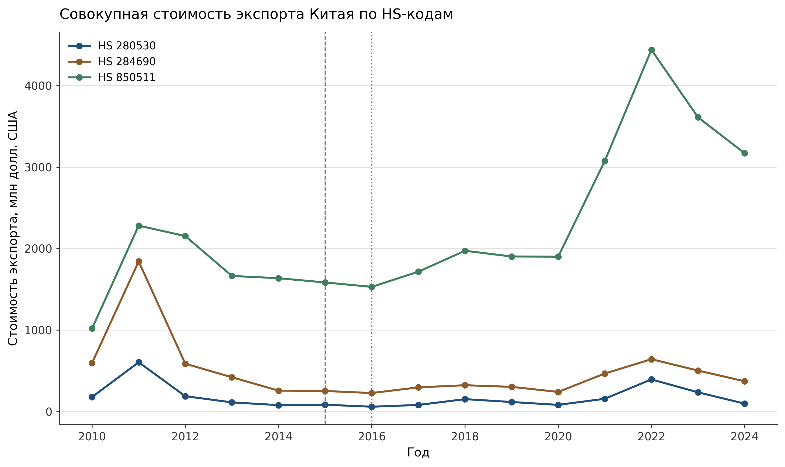
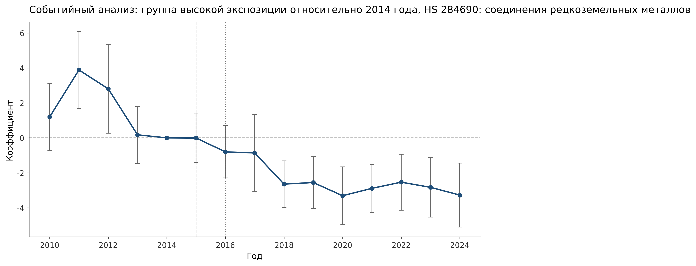

# Политика Китая в экспорте редкоземельных товаров и рыночная экспозиция, 2014-2024

**Репликационный проект к курсовой работе** · НИУ ВШЭ, программа "Мировая экономика", 3 курс<br>
**Автор:** Владимир Семенко · [@semenko-vladimir](https://github.com/semenko-vladimir)

Репозиторий показывает, как изменилась экспортная политика Китая в секторе редкоземельных товаров после отмены прямых экспортных квот и пошлин в 2014-2015 годах, и как это изменение проявилось в двусторонних экспортных потоках на разных стадиях цепочки создания стоимости.

Проект ориентирован на аудиторию Global Markets и товарных рынков: в центре анализа не только цены, но и физическая доступность материалов, концентрация торговли, распределение потоков между странами и уязвимость цепочек поставок критически важных минералов.

## Краткое резюме

| Вопрос | Ответ |
|---|---|
| Рыночный контекст | Китай перешел от прямых пограничных ограничений к внутреннему регулированию добычи, разделения, переработки, лицензирования и консолидации отрасли. |
| Данные | Двусторонний экспорт Китая из WITS / UN Comtrade за 2010-2024 годы по HS 284690, HS 280530 и HS 850511; контрольные переменные World Bank WDI. |
| Базовая модель | Панель "партнер-год" с фиксированными эффектами партнера и года и взаимодействием `Post2016 x HighExposure`. |
| Главный результат | Для HS 284690 импортеры с высокой исходной экспозицией после 2016 года показывают статистически значимо более слабую относительную динамику стоимости экспорта и физического объема. |
| Рыночная интерпретация | Результат указывает на канал объема и структуры торговли, а не на общий ценовой шок в удельной стоимости. |
| Каузальная оговорка | Предтренды не полностью параллельны, поэтому результаты трактуются как структурная эмпирическая связь, а не как строгая каузальная DID-оценка. |

## Выбранные результаты

<p align="center">
  
  
</p>

## Исследовательский вопрос

Как трансформация экспортной политики Китая в 2014-2024 годах связана со структурой китайских экспортных потоков и устойчивостью глобальных цепочек стоимости в секторе редкоземельных товаров?

Более узкий эмпирический вопрос в коде:

> Столкнулись ли торговые партнеры с высокой исходной экспозицией с более слабой динамикой импорта относительно партнеров с низкой экспозицией после того, как постквотный экспортный режим Китая стал полностью действующим?

## Рыночная постановка

Курсовая работа исходит из того, что отмена экспортных квот и пошлин не устранила рыночную силу Китая в редкоземельном секторе. Изменилась форма влияния: вместо прямого экспортного контроля большую роль стали играть внутреннее промышленное регулирование и контроль над средними и нижними стадиями цепочки.

Для анализа товарных рынков и Global Markets это важно, потому что редкоземельный риск виден не только в спотовых ценах. Он может проявляться через:

- физическую доступность переработанных материалов;
- концентрацию экспортных направлений;
- перераспределение торговых потоков между партнерами;
- узкие места в разделении, рафинировании, металлургии и производстве магнитов;
- скрытую экспозицию через промежуточные и конечные компоненты.

## Источники данных

| Источник | Покрытие |
|---|---|
| [WITS / UN Comtrade](https://wits.worldbank.org/) | Двусторонний экспорт Китая за 2010-2024 годы по HS 284690, HS 280530 и HS 850511 |
| [World Bank WDI](https://databank.worldbank.org/source/world-development-indicators) | ВВП, добавленная стоимость обрабатывающей промышленности, доля обрабатывающей промышленности в ВВП |

Ручные фильтры WITS для торговых данных:

- Reporter: China
- Trade flow: Exports
- Partners: все доступные страны-партнеры
- Period: 2010-2024
- Products: `284690` - соединения редкоземельных металлов, `280530` - редкоземельные металлы / скандий / иттрий, `850511` - постоянные магниты и связанные металлические изделия

Обработанные панели сохранены в `data/`, поэтому результаты можно воспроизвести без повторной загрузки исходных файлов WITS. В библиографии работы используются страницы источников WITS, дата обращения зафиксирована в апреле 2026 года.

## Метод

Базовая спецификация - панельная модель с двусторонними фиксированными эффектами:

```text
Y_it = alpha_i + lambda_t + beta * (Post2016_t x HighExposure_i) + epsilon_it
```

где:

- `i` - страна-партнер по импорту, `t` - год;
- `Y_it` - одна из переменных: `ln(1 + ExportValue)`, `ln(1 + ExportQuantity)`, `ln(UnitValue)` или экспортная доля;
- `HighExposure` определяет топ-15 партнеров по среднему докризисному значению импорта в 2010-2014 годах;
- `Post2016` отмечает период после переходного 2015 года;
- стандартные ошибки кластеризованы по стране-партнеру.

Проверки робастности включают:

- PPML-оценивание для нулевых торговых потоков и гетероскедастичности;
- альтернативные пороги экспозиции: топ-10 и топ-20;
- определения экспозиции по стоимости, физическому объему и доле;
- контрольные переменные ВВП и обрабатывающей промышленности из WDI;
- подвыборки только с положительными потоками;
- 2015 год как альтернативную точку отсечения;
- сравнение HS 284690, HS 280530 и HS 850511.

Валидность предтрендов проверяется совместным F-тестом коэффициентов событийного анализа и регрессией непрерывного дифференциального предтренда. Совместный тест предтрендов дает `p = 0.0038`, поэтому оценки следует читать как эмпирически обоснованную связь в структуре рынка, а не как строгий каузальный эффект.

## Ключевые результаты

| Сегмент | HS-код | Результат | Рыночная интерпретация |
|---|---:|---|---|
| Соединения редкоземельных металлов / средняя стадия | 284690 | Отрицательный и статистически значимый эффект для стоимости экспорта и физического объема; нет значимого эффекта по удельной стоимости. | Основное свидетельство канала объема и структуры торговли. |
| Редкоземельные металлы, скандий и иттрий | 280530 | Основной эффект статистически незначим. | Верхняя / металлургическая стадия не воспроизводит паттерн HS 284690. |
| Постоянные магниты / прокси нижней стадии | 850511 | Отрицательный и значимый эффект для стоимости и объема; положительный значимый эффект по удельной стоимости. | Экспозиция нижней стадии ведет себя иначе и может отражать отдельный ценочувствительный канал риска. |

Для HS 284690 основные OLS-оценки:

- `ln(1 + ExportValue)`: beta = `-3.755`, `p < 0.01`;
- `ln(1 + ExportQuantity)`: beta = `-2.309`, `p < 0.01`;
- `ln(UnitValue)`: beta = `0.007`, статистически незначимо;
- экспортная доля: статистически незначимо.

PPML-проверка робастности для HS 284690 подтверждает отрицательный и значимый паттерн для стоимости экспорта и физического объема. См. [`notebooks/run_ree_ppml_robustness.ipynb`](notebooks/run_ree_ppml_robustness.ipynb) и [`results/ppml_robustness_results_hs284690.xlsx`](results/ppml_robustness_results_hs284690.xlsx).

## Практический вывод

Для анализа рисков товарных рынков и цепочек поставок главный вывод состоит в том, что экспозицию в редкоземельном секторе нельзя отслеживать только через цены. Более полезный набор индикаторов должен включать:

- физические объемы по продуктам и партнерам;
- метрики концентрации, например HHI и долю топ-10;
- импортную зависимость по стадиям цепочки стоимости;
- перераспределение потоков между партнерами с высокой экспозицией и прочими странами;
- нижнеуровневую экспозицию через магниты, компоненты и поставщиков Tier-2 / Tier-3.

## Структура репозитория

```text
.
├── notebooks/
│   ├── add_world_bank_controls.ipynb
│   ├── run_ree_model_selection_280530_v3.ipynb
│   ├── run_ree_model_selection_850511_v3.ipynb
│   ├── run_ree_model_selection_v3.ipynb
│   ├── run_main_model_robust_se_hs284690.ipynb
│   ├── run_ree_ppml_robustness.ipynb
│   └── plot_style.py
│
├── src/
│   ├── descriptive_export_structure_analysis.py
│   └── trading_partner_dynamics_analysis_all_codes.py
│
├── data/
│   ├── clean_china_ree_exports_284690_2010_2024.xlsx
│   ├── china_ree_exports_with_controls.xlsx
│   ├── china_ree_exports_280530_with_controls.xlsx
│   └── china_ree_exports_850511_with_controls.xlsx
│
├── results/
│   ├── main_model_robust_se_hs284690.xlsx
│   ├── ppml_robustness_results_hs284690.xlsx
│   ├── ree_model_selection_results_v3.xlsx
│   ├── ree_model_selection_results_280530_v3.xlsx
│   ├── ree_model_selection_results_850511_v3.xlsx
│   ├── descriptive_export_structure_hs284690.xlsx
│   └── trading_partner_dynamics_all_hs_codes.xlsx
│
└── figures/
```

## Как воспроизвести

Рекомендуемая среда: Python 3.11+.

```bash
python -m venv .venv
python -m pip install -r requirements.txt
```

Запускайте ноутбуки по порядку из папки `notebooks/`, потому что пути к данным в них заданы относительно этой директории:

```bash
cd notebooks
python -m notebook
```

1. `add_world_bank_controls.ipynb`
2. `run_ree_model_selection_280530_v3.ipynb`
3. `run_ree_model_selection_850511_v3.ipynb`
4. `run_ree_model_selection_v3.ipynb`
5. `run_main_model_robust_se_hs284690.ipynb`
6. `run_ree_ppml_robustness.ipynb`

Затем вернитесь в корень репозитория и запустите отдельные описательные скрипты:

```bash
cd ..
python src/descriptive_export_structure_analysis.py
python src/trading_partner_dynamics_analysis_all_codes.py
```

Предварительно рассчитанные Excel-таблицы и графики уже сохранены в `results/` и `figures/`.
